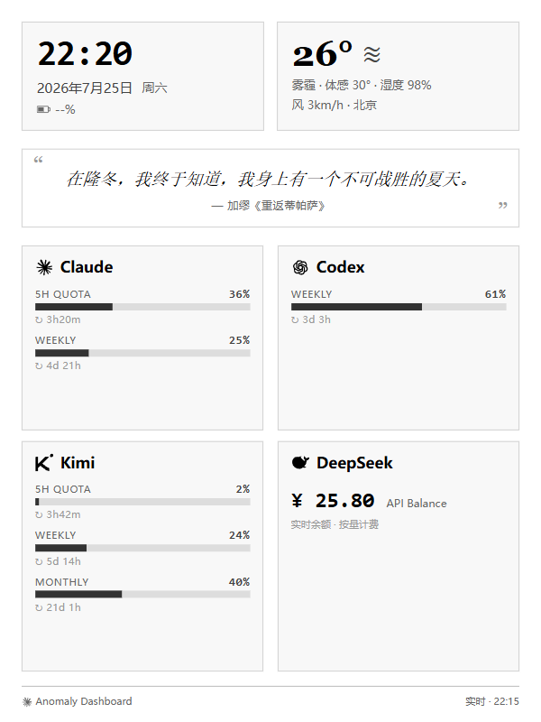

# Kindle AI 额度中控台

把吃灰的 Kindle 变成 AI 额度监控屏。实时显示智谱 GLM（双账号）、Kimi、MiniMax 的用量，外加天气和每日一语。

**不需要同一个 WiFi。** 电脑和 Kindle 可以在不同的网络——数据通过自建服务器中转，只要两边都能连上服务器就行。



---

## 它能做什么？

- **跨网络实时同步**——电脑在公司、Kindle 在家，额度照样更新
- 实时监控多个 AI 平台的额度用量（支持智谱 GLM 多账号 / Kimi / MiniMax，可自行增减）
- 在 Kindle 墨水屏上全屏显示，放桌上一眼就能看到谁快没额度了
- 自带天气显示、电池电量、每日一语
- 夜间自动省电（03:00–08:00 停止刷新）
- 局部 DOM 更新，不整页刷新，减少墨水屏闪烁
- 隐私优先——所有 API 密钥和令牌只留在你的电脑上，不会进入 Git

## 我需要什么？

- 一台 Kindle（越狱后体验最佳，也可以用自带浏览器先试试效果）
- 一台常开的电脑（Windows / Mac / Linux，用来采集额度数据）
- 一台能跑 Docker 的服务器（用于托管仪表盘页面和数据中转）
- 至少一个 AI Agent（Claude Code 或 Codex）来帮你完成配置

> 为什么需要 Agent？因为你既然用这个中控台来监控 AI 额度，说明你已经在用 AI 了。让它帮你配环境、改代码，比你自己照着文档折腾快十倍。

## 怎么用？

**这个项目的设计理念是：你负责动手，Agent 负责动脑。**

### 第一步：Fork 仓库

点右上角的 Fork，把这个仓库复制到你的 GitHub 账号下。

### 第二步：把仓库交给你的 Agent

把仓库地址丢给你的 Claude Code 或 Codex，告诉它：

> "我想用 Kindle 做一个 AI 额度中控台。这是开源项目的仓库，帮我看看怎么在我的电脑上跑起来。我用的 AI 平台是 ____（列出你在用的），我的 Kindle 型号是 ____，我的电脑是 Windows / Mac。"

Agent 会阅读仓库里的代码和文档，然后告诉你：
- 需要你提供哪些 API 凭证
- 如何在你的电脑上设置采集脚本
- 如何配置自建服务器作为数据中转

### 第三步：越狱 Kindle

这一步需要你亲自操作（Agent 可以指导你，但按钮得你按）。

推荐方案是 [WinterBreak](https://kindlemodding.org/jailbreaking/WinterBreak/)，具体操作流程让你的 Agent 根据你的 Kindle 型号和固件版本来指导。核心要点：

1. **先开飞行模式**，防止固件自动升级
2. 按照越狱指南操作
3. 安装 KUAL + KOReader

越狱完成后，你的 Agent 可以通过 KOReader 的 SSH 功能把中控台部署到 Kindle 上。

> 不想越狱？也可以用 Kindle 自带的「体验版浏览器」打开仪表盘链接来查看，只是不能全屏、会自动息屏。

### 第四步：告诉 Agent 你的偏好

- 你想监控哪几家 AI 的额度？（只用 Claude 一家也行）
- 每日一语想要什么风格？（古诗词 / 外国文学 / 励志 / 随机）
- 前端想不想自己改？（颜色、布局、卡片顺序等都可以 DIY）

Agent 会帮你配好一切。配好之后，Kindle 上就是全屏仪表盘，放桌上当额度监控屏。

---

## 先看看效果（不需要 Kindle）

需要 Node.js 18+，不需要安装第三方依赖：

```bash
git clone https://github.com/Avenil2026/kindle-ai-quota-dashboard.git
cd kindle-ai-quota-dashboard
npm run demo
npm run build
npm run serve
```

浏览器打开 `http://127.0.0.1:8787`，看到的是假数据演示——不会读取任何真实账户信息。

---

## 架构简述

```
你的电脑（采集器）                     Kindle（越狱 + 全屏 Chromium）
  │                                      │
  ├─ 定时采集各 AI 平台额度              ├─ 每 3 分钟从服务器拉数据
  ├─ 生成 data.js / data.json            ├─ 局部 DOM 更新（不闪屏）
  └─ rsync 推送到自建服务器              └─ 03:00–08:00 夜间省电
                    │                      │
                    └── 自建服务器（nginx）──┘
                          （数据中转站）
```

电脑和 Kindle **不需要在同一个网络**。数据通过自建服务器中转——电脑 rsync 推上去，Kindle 从服务器拉取。

## 部署到自己的服务器

**服务器端（一次性）**：把 `deploy/server/docker-compose.yml` 上传到服务器，然后：

```bash
mkdir -p /opt/kindle-dashboard/site
cd /opt/kindle-dashboard && docker compose up -d   # 默认监听 8787 端口
```

**Mac 端（日常）**：配置好免密 SSH 后，一条命令完成采集→构建→推送：

```bash
export DEPLOY_TARGET=root@服务器IP:/opt/kindle-dashboard/site
npm run sync
```

Kindle 浏览器打开 `http://服务器IP:8787` 即可。配合 crontab 定时执行：

```cron
*/10 * * * * cd /path/to/kindle-ai-quota-dashboard && npm run sync   # 每 10 分钟采集并推送
0 7 * * *    cd /path/to/kindle-ai-quota-dashboard && npm run quote  # 每天早上换一句
```

## 接入真实数据

1. 复制配置模板：`config.example.json` → `config.json`
2. 只开启你需要的数据源（把对应 `enabled` 改为 `true`）
3. API 密钥放在环境变量里，不要写进配置文件
4. 运行 `npm run collect` + `npm run build`

每个数据源默认都是关闭的，你只开你用的：

| 数据源 | 数据来源 | 说明 |
|--------|---------|------|
| GLM-1 / GLM-2 | 环境变量 `GLM1_API_KEY` / `GLM2_API_KEY` | 智谱 Coding Plan 额度，国内站 `open.bigmodel.cn`（国际站可把 `baseUrl` 改为 `https://api.z.ai`），支持任意多个账号 |
| Kimi | 环境变量 `KIMI_API_KEY` | Kimi Coding Plan 额度；也可回退读取本机 Kimi Code 登录凭证（需显式开启） |
| MiniMax | 环境变量 `MINIMAX_API_KEY` | MiniMax Coding Plan 额度，国内站 `api.minimaxi.com`（国际站可把 `baseUrl` 改为 `https://api.minimax.io`） |

各平台额度接口的调用方式参考了开源项目 [cc-switch](https://github.com/farion1231/cc-switch) 的实现。

详见 [系统架构](docs/architecture.md)。

## 天气

天气数据从你提供的 JSON 文件读取。可以用任意免费天气 API 生成这个文件（比如 [wttr.in](https://wttr.in)、[OpenWeatherMap 免费版](https://openweathermap.org/price)），不需要额外花钱。

把 `examples/weather.example.json` 复制到 `config/` 目录，然后告诉你的 Agent 你在哪个城市，它会帮你配好自动更新。

## 每日一语

内置了自动生成脚本，调用 GLM Coding Plan 的对话接口（走订阅额度，不另花钱）：

```bash
npm run quote                          # 随机风格，写入 config/quote.json
node scripts/gen-quote.cjs --style 古诗词  # 指定风格（古诗词/外国文学/励志）
```

- API Key 默认复用 `GLM1_API_KEY`，也可用 `QUOTE_API_KEY` 单独指定；模型用 `QUOTE_MODEL` 覆盖（默认 glm-5.2）
- 没有 Key 或调用失败时，自动回退到内置句库按日轮换，Kindle 上永远有句子
- 配合定时任务每天跑一次即可（cron 示例：`0 7 * * * cd /path/to/repo && npm run quote`）

也可以不用脚本，直接手动编辑 `config/quote.json`（模板见 `examples/quote.example.json`）。

## DIY 前端

前端是纯 HTML + CSS + JS，没有框架依赖，随便改。

| 文件 | 用途 |
|------|------|
| `web/index.html` | 主页面 |
| `web/style.css` | 样式 |
| `web/dashboard-runtime.js` | 数据拉取和渲染逻辑 |

想改颜色和字体？直接改 CSS。想加一个新的 AI 平台？在 `src/collectors/` 里加一个采集器，Agent 会帮你搞定。

改完之后运行 `npm run build` 重新构建，然后让 Agent 同步到 Kindle。

## 跨平台说明

采集脚本是 Node.js 写的，Windows / Mac / Linux 都能跑。不同平台有一些小差异（凭证路径、定时任务方式、SSH 工具），但这些你的 Agent 都能处理——告诉它你的操作系统就行。

## 常见问题

**Q: 必须越狱才能用吗？**
作为全屏 APP 需要越狱。但你也可以先用 Kindle 自带的「体验版浏览器」打开仪表盘链接来看看效果，只是不能全屏、会自动息屏。

**Q: 会不会把 Kindle 搞坏？**
越狱本身有极小概率的风险，但只要按官方指南操作、不跳步骤，基本不会出问题。中控台本身不修改 Kindle 系统文件。

**Q: 额度数据是公开的吗？**
数据托管在你自己的服务器上，谁能看到取决于你的端口/防火墙策略。数据里**不包含任何 API 密钥或登录凭证**——采集脚本会自动过滤掉敏感信息，公网可见的只有额度百分比。部署前建议阅读 [隐私说明](docs/privacy.md)。

**Q: Kindle 费电吗？**
比正常待机费一些（屏幕常亮 + 定时联网）。有夜间省电模式，03:00–08:00 自动停止刷新。

**Q: 我只用其中一家，也能用吗？**
能。在 `config.json` 里只开启你用的数据源就行，前端会自动适配。

**Q: 天气需要单独买 API 吗？**
不需要。可以用免费的公共天气 API，Agent 会帮你配好。

## 更多文档

- [系统架构](docs/architecture.md)
- [隐私说明](docs/privacy.md)
- [Kindle 兼容性与恢复](docs/compatibility.md)
- [故障排查](docs/troubleshooting.md)
- [安全说明](SECURITY.md)
- [参与贡献](CONTRIBUTING.md)

## 许可证

[MIT License](LICENSE)

---

*这个项目最初是为了解决一个很朴素的需求：家里的 AI 太多了，每次查额度都得一个一个登进去看。不如让 Kindle 替我盯着，放在桌上一眼就知道。*

*Made with ♡ by Avenil & Codex*
